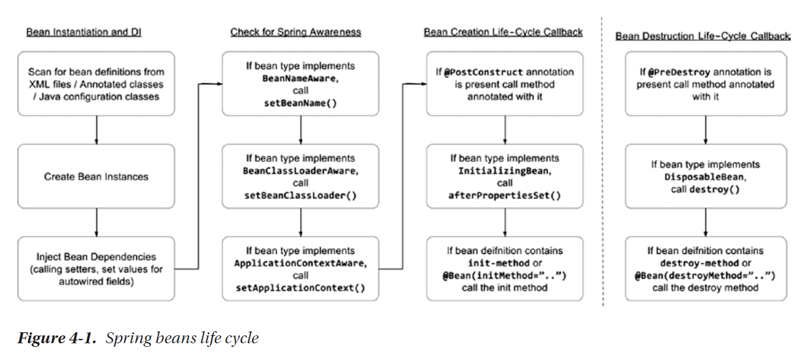

# List Of Knowledge:

* Class Configuration + Annotation Configuration

* Phantom Requirement

* PropertyEditor

* Bean Notification Lifecycle: 
    - post-initialization
    - pre-destruction

* BeanCreationException

* Shutdown Hook For Destroying Beans

* Lazy Bean Initialization

* Hook Mechanism 
    - interface-based
    - method-based
    - annotation-based)

* FactoryBean (CacheFactory)

* 